# Spot 画面カタログ（UIスクリーンショット記録）

Spot アプリ（`spot-app/index.html`）の全主要画面のスクリーンショット記録です。トーンオブボイス（[「頼れる相棒」](./tone-of-voice.md)）適用後の最終状態。

- **撮影日**: 2026-09-22
- **表示言語**: 日本語（デバイス言語＝日本語の既定表示）
- **テーマ**: ダーク（アプリ標準・[design-system.md](./design-system.md) のトークン）
- **表示幅**: デスクトップ 1400px（サイドバー付き）
- **備考**: プロトタイプ表示。数値・一覧はダミー/未接続のためプレースホルダ（`—`）や空カードで表示されます。文言・レイアウトの記録が目的です。
- **再生成**: `spot-app` を `localhost:5500` で起動し、`docs/screens/` の各PNGを撮影（ヘッドレスChrome）。

---

## 認証（サインイン）
サインイン / 新規登録（個人・組織）/ 認証番号（OTP）/ パスワード再設定 を1画面のモード切替で提供。

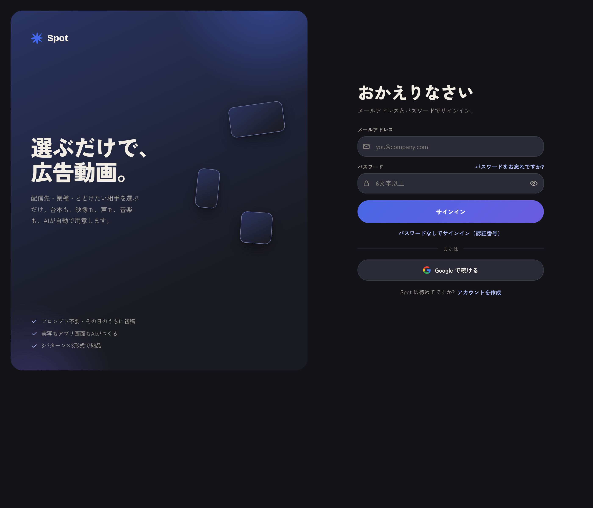

---

## ホーム
今月つくったCM・クレジット残・「何の広告をつくりますか?」の配信先選択・つくり方3ステップ。

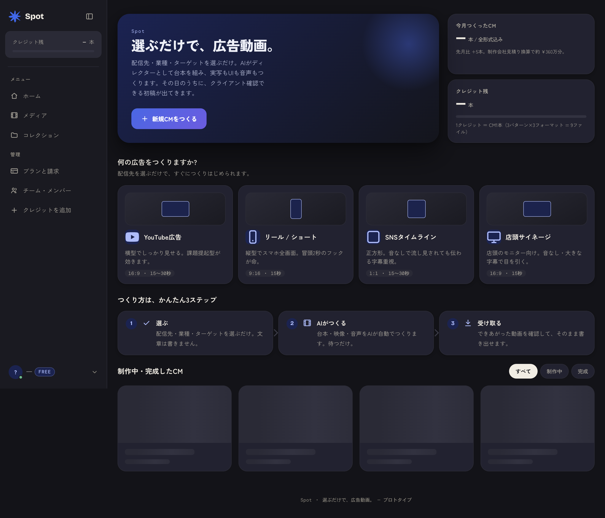

---

## 新規CM（ウィザード）
プロンプト不要。配信先 → 業種 → ターゲット → 伝え方・トーン を選ぶだけ。右下にAIのおすすめ構成。

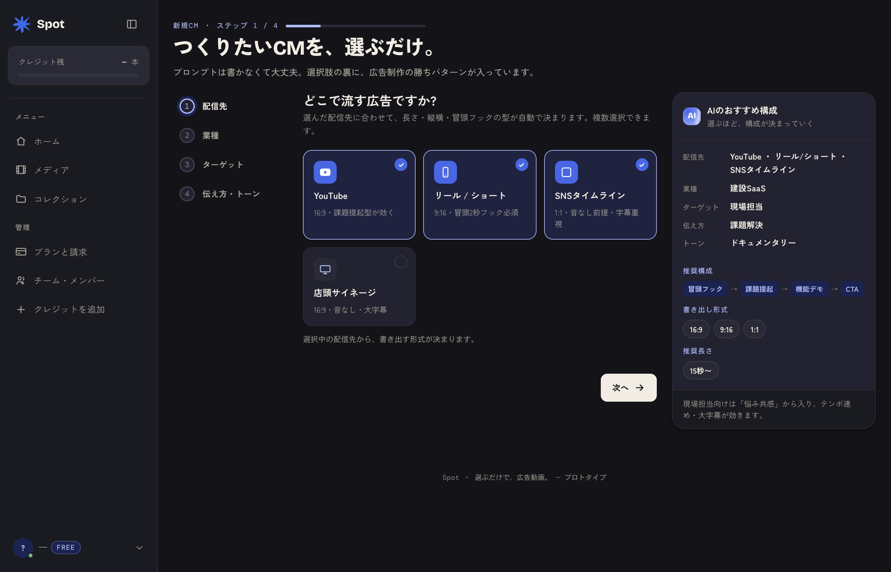

---

## 台本と絵コンテ
AIがディレクターとして構成を作成。各カットを言葉で調整でき、「AIにおまかせ / 台本を持ち込む」を切替。

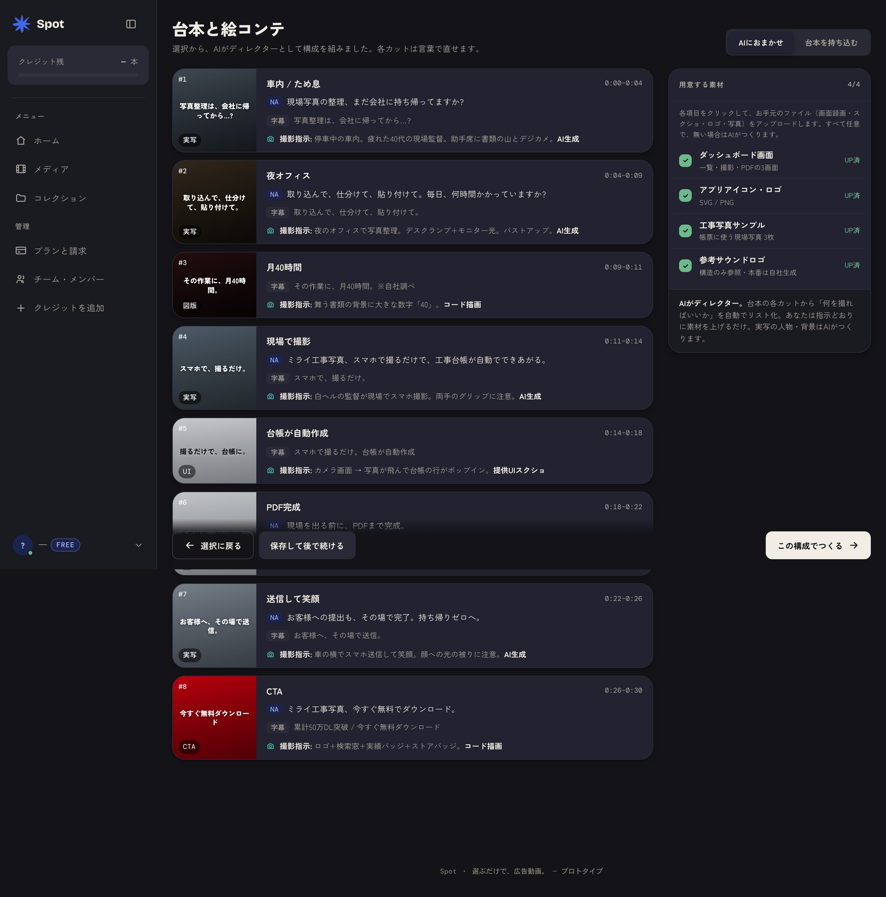

---

## 書き出し
3パターン（A/B/C）× 3形式（横・縦・正方形）＝ 9本。クライアント提示用の形式で出力。

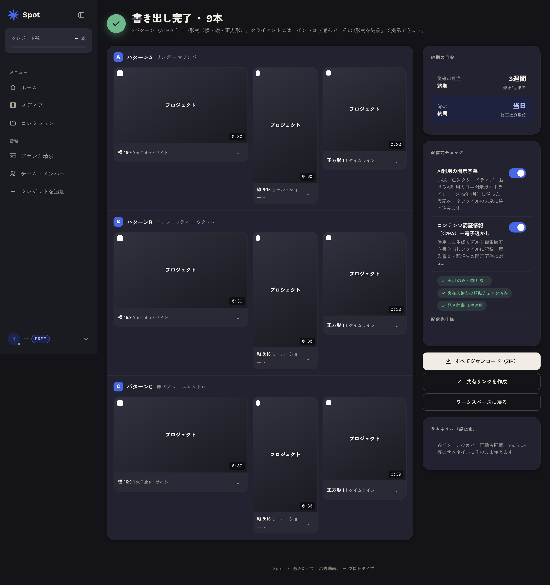

---

## 制作ワークスペース
制作パイプライン（ブリーフ→台本→撮影指示→制作→チェック→書き出し）、プレビュー、声・トーン選択、品質チェック。

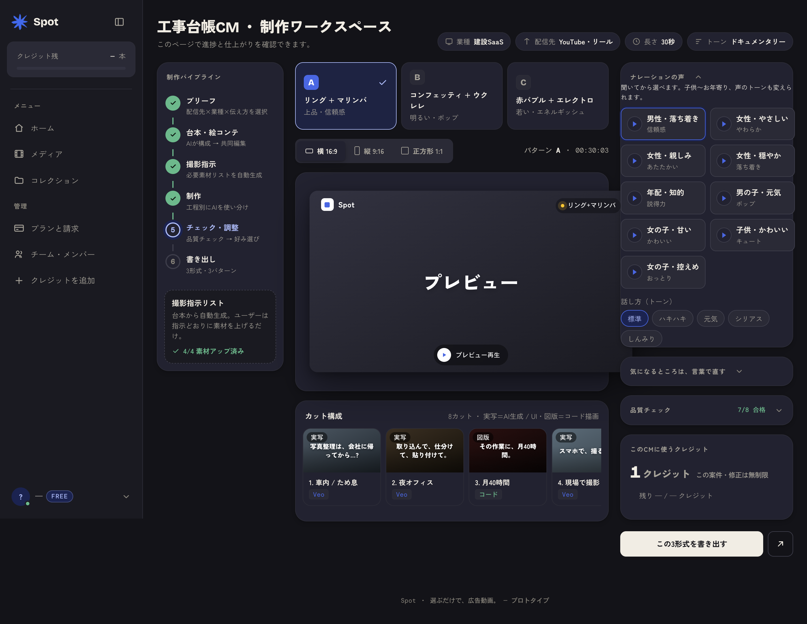

---

## プロフィール設定
アイコン・表示名・メールアドレス。

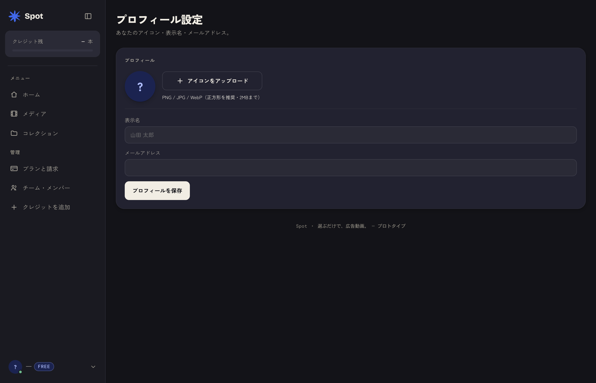

---

## アカウント設定
パスワード・通知・表示言語。

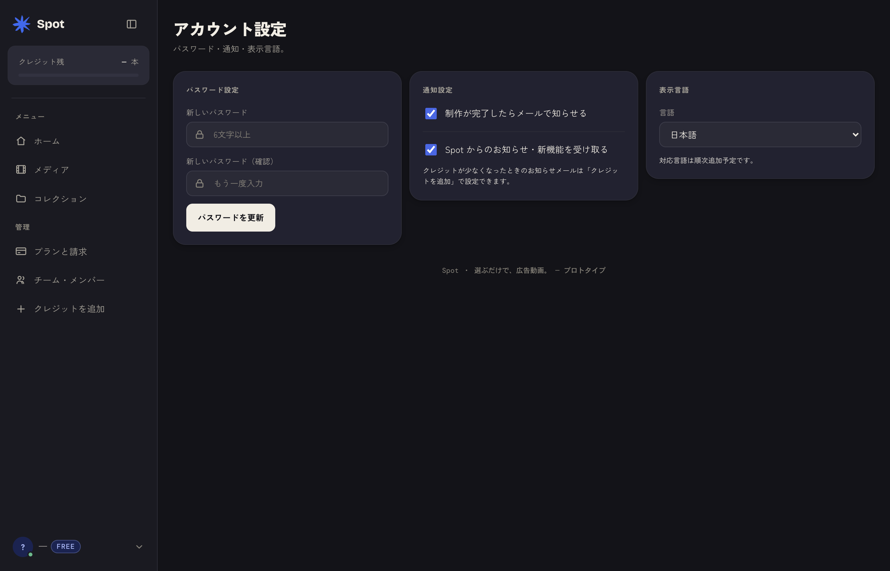

---

## チーム・メンバー
メンバー招待・同一ワークスペースでの制作（席数管理）。

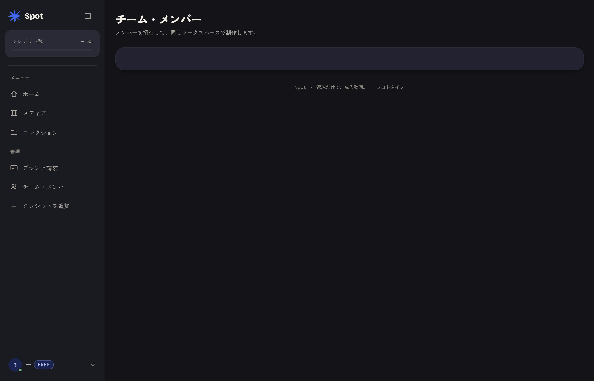

---

## メディア
つくった動画の一覧（すべて / 制作中 / 完成）。

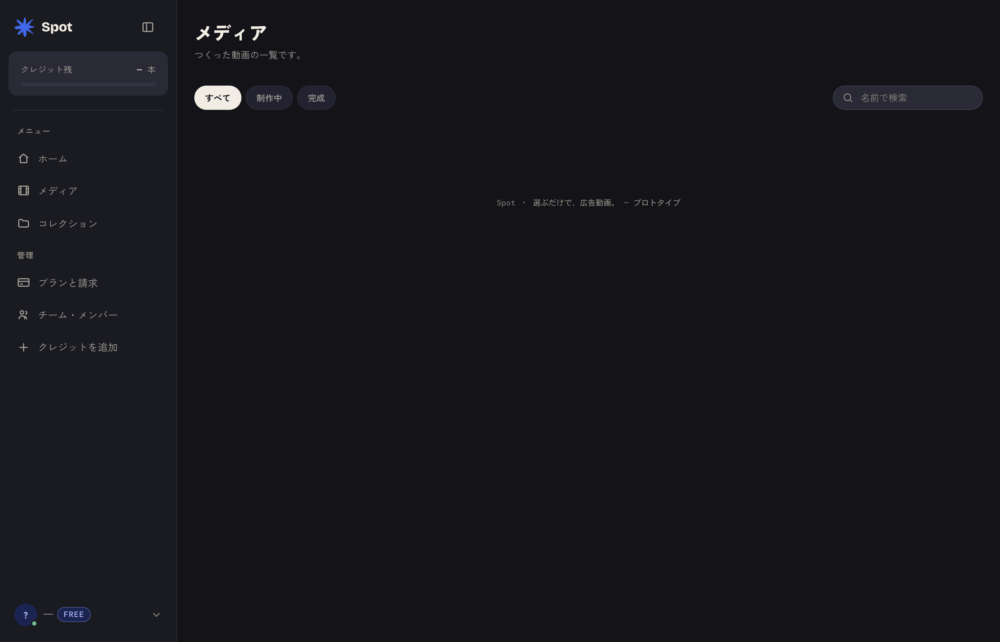

---

## コレクション
動画をフォルダのように整理。

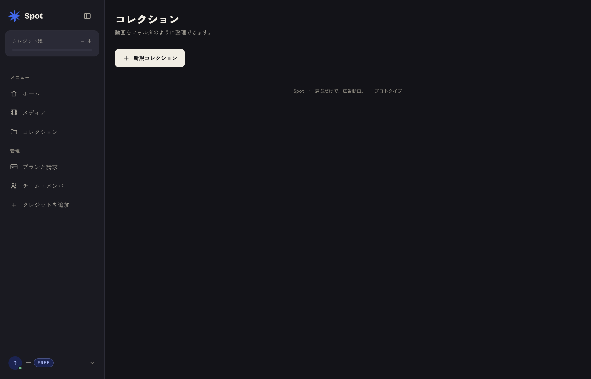

---

## プランと請求
現在のプランと残クレジット、プラン変更（月払い/年払い）、お支払い履歴。

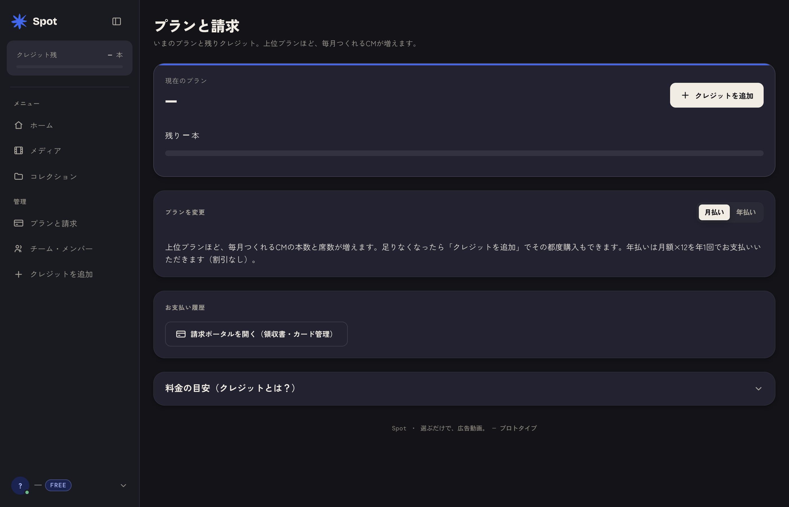

---

## クレジットを追加
一回購入・自動チャージ設定・利用明細。

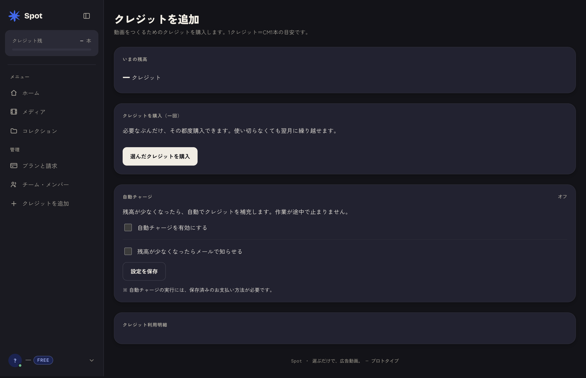
